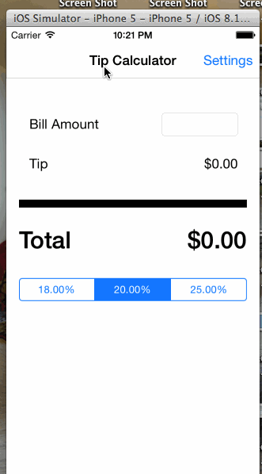

Sample app for CodePath iOS class

Time spent: 6 hours spent in total

Completed stories:

 * [x] Required: Main screen calculates tip
 * [x] Required: Settings screen
 * [x] Optional: User can choose a default tip
 * [x] Optional: User can add, delete and rearrange tip options from Settings
 
Notes:

Known issues: 

* newly added tips aren't draggable
* "Back" from settings page saves instead of cancels
* Tips & default are re-initialized at app load

Walkthrough of all user stories:

GIF created with [LiceCap](http://www.cockos.com/licecap/).
